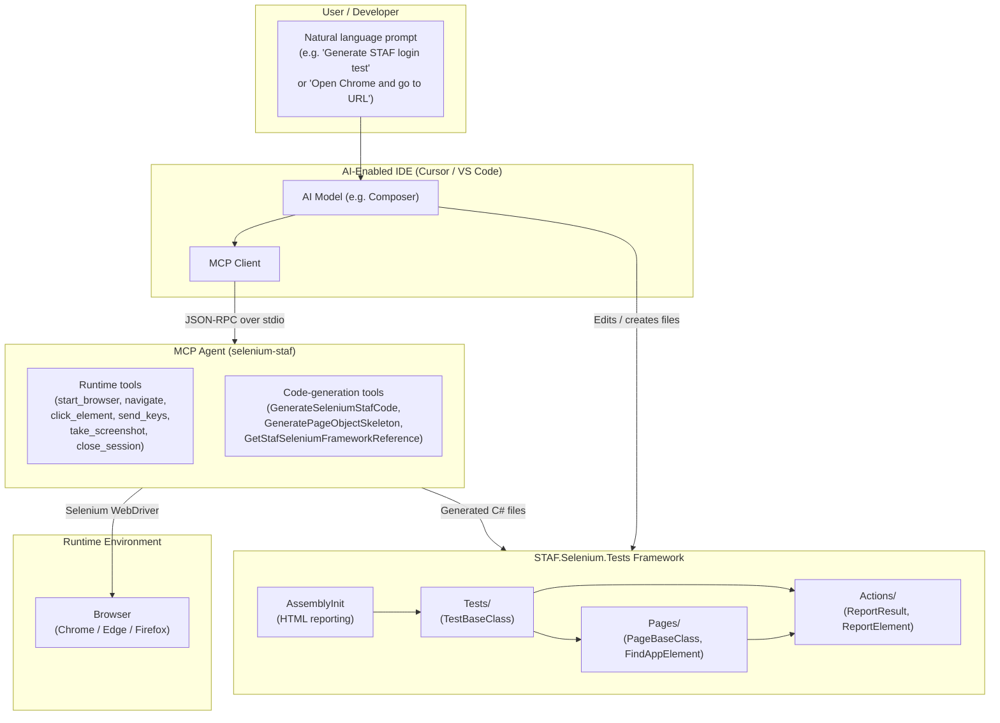
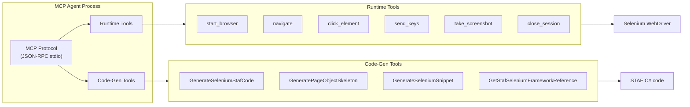
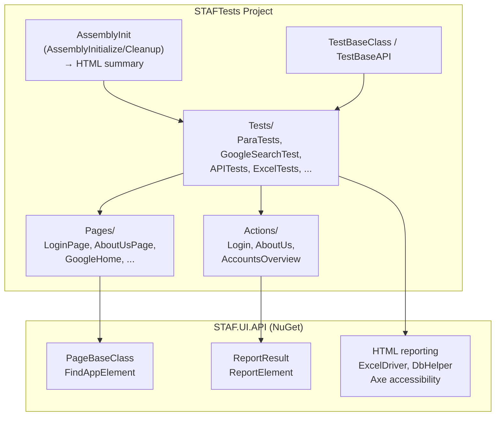

# STAF.Selenium.Tests – Architecture Diagram

This file contains the **high-level architecture diagram** for the STAF.Selenium.Tests framework and MCP Agent integration. It can be rendered in any Markdown viewer that supports Mermaid (e.g., GitHub, VS Code with Mermaid extension, or [mermaid.live](https://mermaid.live)).

---

## System Context: User → IDE → MCP Agent → Browser / Framework

---

## MCP Agent Internal View (Tools)

---

## STAF Framework Structure (Test Project)

---

## Summary

| Layer | Responsibility |
|-------|----------------|
| **User** | Asks the AI (in natural language) to automate the browser or generate STAF tests. |
| **IDE (Cursor/VS Code)** | Runs the AI model and MCP client; starts the MCP Agent via `.cursor/mcp.json` / `.vscode/mcp.json`. |
| **MCP Agent** | Exposes tools: (1) runtime—control browser via Selenium; (2) code-gen—return STAF-conformant C#. Communicates with IDE over MCP (JSON-RPC over stdio). |
| **Browser** | Started and controlled by the MCP Agent when runtime tools are used. |
| **STAF.Selenium.Tests** | MSTest project using STAF.UI.API; receives generated or hand-written Pages, Actions, and Tests; runs via `dotnet test` or IDE. |

For full technical architecture and novelty, see [Technical-Architecture.md](Technical-Architecture.md).
