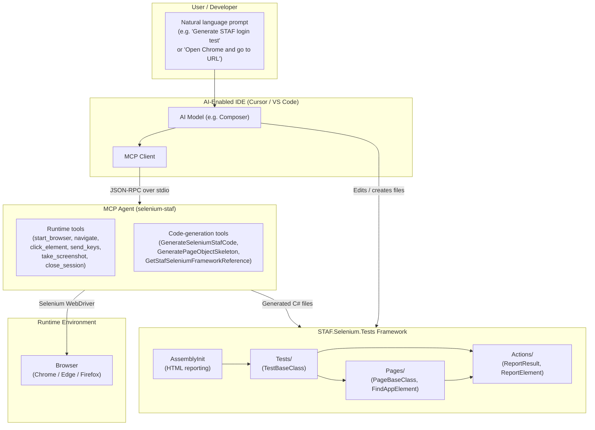

# STAF.Selenium.Tests – Technical Architecture

**Document Version:** 1.0  
**Last Updated:** February 2026  
**Purpose:** Technical architecture, MCP Agent usage, and novelty summary for legal and technical review.

---

## 1. Executive Summary

This document describes the **technical architecture** of the **STAF.Selenium.Tests** framework—a Selenium-based UI and API test automation solution that integrates an **MCP (Model Context Protocol) Agent** for AI-assisted development.

**In plain terms:**

- **What it is:** A test automation framework (STAF) that runs Selenium UI tests and API tests, plus an optional **MCP Agent**—a small, self-contained program that runs inside AI-powered editors (Cursor, VS Code). The Agent lets the AI assistant both **control a browser** (navigate, click, type, screenshot) and **generate test code** that follows the framework’s conventions.
- **How MCP is used:** The MCP Agent is a **separate executable** (`mcp-sharp-staf-selenium.exe`) configured in the editor (`.cursor/mcp.json`, `.vscode/mcp.json`). When the user asks the AI to automate a browser or write tests, the editor talks to this executable over the **Model Context Protocol**. The Agent does not modify the test framework itself; it exposes **tools** (e.g., “start browser,” “generate STAF code”) that the AI can call. All generated code is standard C# and follows the framework’s existing patterns (Page Object Model, reporting, base classes).
- **Novelty:** The combination of (1) a **single MCP server** that provides both **runtime browser control** and **framework-aware code generation**, (2) **STAF-specific** code generation (Pages, Actions, Tests, ReportResult, FindAppElement), and (3) **out-of-box** integration (preconfigured MCP, self-contained exe, no extra SDK) is what makes this approach distinctive. See Section 4 for a detailed novelty summary.

This architecture is suitable for **attorney or compliance review** (clear boundaries, no training on user data, standard protocols) and for **technical architect review** (diagrams, data flow, and design rationale below). A formal document for **academic and legal review** (architecture description and technical innovations) is provided in [STAF-Framework-Architecture-and-Technical-Innovation.md](STAF-Framework-Architecture-and-Technical-Innovation.md).

---

## 2. High-Level Architecture

### 2.1 Components Overview

| Component | Description | Location / Artifact |
|-----------|-------------|----------------------|
| **STAF Test Project** | MSTest-based test suite using STAF.UI.API (Selenium, reporting, Page Object Model, API/Excel/DB helpers). | `STAFTests/` (C# project) |
| **STAF.UI.API** | NuGet package: TestBaseClass, PageBaseClass, ReportResult, ReportElement, HTML reporting, ExcelDriver, DbHelper, Axe accessibility. | Package reference |
| **MCP Agent** | Model Context Protocol server: browser automation tools + STAF code-generation tools. Runs as a separate process, invoked by the IDE. | `MCPAgent/publish/mcp-sharp-staf-selenium.exe` |
| **IDE MCP config** | Tells Cursor/VS Code how to start the MCP server (command, args). | `.cursor/mcp.json`, `.vscode/mcp.json` |
| **Test config** | Browser, URLs, credentials, parallelization, reporting. | `testrunsetting.runsettings`, `appsettings.json` |

### 2.2 Architecture Diagram

The following diagram shows how the **user**, **IDE**, **MCP Agent**, and **STAF test framework** interact. A standalone diagram file is in `docs/Architecture-Diagram.md`.

**Data flow in words:**

1. **User** types a prompt in the IDE (e.g., “Generate a STAF Page Object for the login page” or “Start Chrome and take a screenshot”).
2. **IDE (AI model + MCP client)** interprets the prompt and may call **MCP tools** exposed by the **MCP Agent**.
3. **MCP Agent** runs as a **separate process** (started by the IDE via `mcp.json`). It communicates over **stdio** using the **Model Context Protocol** (JSON-RPC).
4. **Runtime tools:** The Agent can start a browser via Selenium WebDriver, navigate, click, type, take screenshots. The browser runs in the same machine as the Agent.
5. **Code-generation tools:** The Agent can return **STAF-conformant** C# code (Pages, Actions, Tests, ReportResult, FindAppElement). The AI/IDE then writes this into the repo (e.g., `STAFTests/Pages/`, `STAFTests/Actions/`, `STAFTests/Tests/`).
6. **Framework:** The existing STAF test project uses **TestBaseClass**, **PageBaseClass**, **ReportResult**, **ReportElement**, and **AssemblyInit**; tests are run via **MSTest** (IDE or `dotnet test`). The MCP Agent does **not** execute tests; it only provides tools for the AI to drive the browser or generate code.

---

## 3. MCP Agent – Usage and Integration

### 3.1 What Is the MCP Agent?

The **MCP Agent** is a **Model Context Protocol (MCP) server** named **selenium-staf**. It is implemented in a separate repository ([mcp-sharp-staf-selenium](https://github.com/sooraj171/mcp-sharp-staf-selenium)) and published as a **self-contained Windows executable** into this repo at `MCPAgent/publish/mcp-sharp-staf-selenium.exe`. No .NET SDK is required on the machine to run it—only the exe and its runtime files.

### 3.2 How the MCP Agent Is Used

| Step | Actor | Action |
|------|--------|--------|
| 1 | Developer | Opens the STAF.Selenium.Tests solution in Cursor or VS Code. |
| 2 | IDE | Reads `.cursor/mcp.json` or `.vscode/mcp.json` and starts the MCP server process: `MCPAgent/publish/mcp-sharp-staf-selenium.exe`. |
| 3 | IDE | Establishes an MCP session (JSON-RPC over stdio) with the **selenium-staf** server. |
| 4 | Developer | Asks the AI (in chat) to, for example: “Use selenium-staf to generate a STAF login test” or “Open Chrome, go to example.com, and take a screenshot.” |
| 5 | AI (Composer/Agent) | Decides to call one or more **tools** exposed by the selenium-staf server. |
| 6 | MCP Agent | Executes the tool: e.g., starts a browser and performs actions, or returns generated C# code (STAF Pages/Actions/Tests). |
| 7 | AI / IDE | Uses the tool result to reply to the user or to create/edit files in the framework (e.g., new Page or Test class). |

The MCP Agent **does not**:

- Execute MSTest or run the STAF test suite.
- Access the user’s source code except when the AI uses code-generation tool **output** to write files.
- Store or train on user data; it only responds to tool invocations with immediate results.

### 3.3 MCP Tools Exposed (Summary)

| Category | Examples | Purpose |
|----------|----------|---------|
| **Runtime (browser)** | `start_browser`, `navigate`, `find_element`, `click_element`, `send_keys`, `get_element_text`, `hover`, `take_screenshot`, `close_session` | Let the AI drive a real browser for exploration or validation. |
| **Code generation** | `GenerateSeleniumStafCode`, `GenerateSeleniumSnippet`, `GeneratePageObjectSkeleton`, `GetSeleniumGuidance`, `GetStafSeleniumFrameworkReference` | Produce or explain STAF-conformant C# (Page Object Model, ReportResult, TestBaseClass). |

Detailed tool lists and parameters are in [MCPAgent/README.md](../MCPAgent/README.md) and in the mcp-sharp-staf-selenium repository.

### 3.4 Configuration (Reproducibility)

- **Cursor:** `.cursor/mcp.json` → `"command": "MCPAgent/publish/mcp-sharp-staf-selenium.exe"`.
- **VS Code:** `.vscode/mcp.json` → same command.
- **Rebuild:** If the MCP server source is available, run `.\MCPAgent\build-mcp-agent.ps1` to republish the exe into `MCPAgent/publish/`.

This gives a **reproducible, versioned** integration: the same repo commit includes both the test framework and the MCP Agent binary used for AI-assisted development.

---

## 4. Novelty of the Approach

The following points summarize what is **novel or distinctive** about this Selenium framework from both a **product** and an **implementation** perspective. They are written so an **attorney** can assess scope and claims, and a **technical architect** can validate design and quality.

### 4.1 Single MCP Server: Runtime + Code Generation

- **What:** One MCP server (**selenium-staf**) provides both **browser automation tools** (start, navigate, click, type, screenshot) and **framework-aware code-generation tools** (full STAF scenarios, Page Object skeletons, snippets, guidance).
- **Why it matters:** The AI can switch between “drive the app in a browser” and “generate tests that match our framework” without switching servers or context. This supports a single workflow: explore with the browser, then generate conformant code from the same MCP server.

### 4.2 Framework-Aware Code Generation (STAF-Specific)

- **What:** Code-generation tools are not generic Selenium snippets. They produce **STAF-specific** structure:
  - **Pages** using `PageBaseClass` and `FindAppElement(By)` / `FindAppElement(parent, By, description)`.
  - **Actions** that use `ReportResult.ReportResultPass/Fail` and `ReportElement` (e.g., `ReportElementIsDisplayed`).
  - **Tests** inheriting `TestBaseClass`, using `driver` and `TestContext`, and following the project layout (Pages/, Actions/, Tests/).
- **Why it matters:** Generated code fits directly into the existing framework and reporting (HTML reports, AssemblyInit). This reduces manual refactoring and keeps patterns consistent—something a technical architect can verify against the codebase.

### 4.3 Out-of-Box AI Integration

- **What:** The repository ships with (1) preconfigured MCP in `.cursor/mcp.json` and `.vscode/mcp.json`, (2) a self-contained MCP Agent exe in `MCPAgent/publish/`, and (3) no requirement for a .NET SDK to run the Agent.
- **Why it matters:** A developer can clone the repo, open it in Cursor or VS Code, and immediately use AI to control the browser or generate STAF code. This lowers adoption cost and makes the “MCP + STAF” combination a first-class part of the framework’s offering.

### 4.4 Clear Separation of Concerns

- **What:** The MCP Agent is a **separate process** and a **separate codebase** (mcp-sharp-staf-selenium). The test framework (STAFTests) does not depend on the MCP server at build or test run time. Tests run via MSTest with or without the IDE/MCP.
- **Why it matters:** From a legal/architectural perspective: the framework remains a standard .NET test project; the MCP integration is additive and optional. No user data is sent to the MCP server beyond what the user explicitly asks the AI to do (e.g., “navigate to this URL”), and the protocol (MCP over stdio) is well-defined and auditable.

### 4.5 Unified STAF Stack (UI, API, Reporting, Accessibility)

- **What:** The same solution demonstrates **TestBaseClass** (UI), **TestBaseAPI** (API/Excel/DB), **ReportResult** / **ReportResultAPI**, **ReportElement**, **HTML reporting** (AssemblyInit), and **Axe accessibility** (e.g., AnalyzePageAndSaveHtml). The MCP code-generation tools are designed to generate code that fits this stack (e.g., ReportResult in Actions, TestBaseClass in Tests).
- **Why it matters:** The “novelty” is not only “MCP + Selenium” but “MCP + a **full** STAF stack” with consistent patterns and reporting—enabling AI-assisted development across UI, API, and accessibility tests in one place.

---

## 5. Technical Architect Review – Summary

For a **technical architect** reviewing this document and the codebase, the following can be confirmed:

| Criterion | Status | Notes |
|-----------|--------|--------|
| **Architecture clarity** | ✅ | Diagram and components (Section 2) show user → IDE → MCP Agent → browser / generated code → framework. |
| **MCP usage** | ✅ | MCP Agent is a separate process; communication is JSON-RPC over stdio; no coupling at build/run time between STAF tests and MCP. |
| **Framework consistency** | ✅ | Generated code follows PageBaseClass, FindAppElement, ReportResult, ReportElement, TestBaseClass, and folder layout (Pages/, Actions/, Tests/). |
| **Reproducibility** | ✅ | MCP config and published exe are in the repo; build script documents how to rebuild the Agent. |
| **Security / boundaries** | ✅ | Agent does not execute tests or read arbitrary files; it only responds to tool calls (browser control or code generation). |
| **Novelty** | ✅ | Single MCP server for runtime + STAF-aware code generation, out-of-box IDE config, and clear separation from the test runtime. |

If you need **patent or IP** wording, the novelty sections (4.1–4.5) can be adapted into claim-style language; for **compliance**, the executive summary and Section 3.2 describe how MCP is used and what the Agent does not do.

---

## 6. References

- **STAF:** [https://github.com/sooraj171/STAF](https://github.com/sooraj171/STAF)
- **STAF.UI.API (NuGet):** [https://www.nuget.org/packages/STAF.UI.API](https://www.nuget.org/packages/STAF.UI.API)
- **MCP Agent (this repo):** [MCPAgent/README.md](../MCPAgent/README.md)
- **MCP server source:** [mcp-sharp-staf-selenium](https://github.com/sooraj171/mcp-sharp-staf-selenium)
- **Model Context Protocol:** Industry-standard protocol for AI tools and context; see [Anthropic MCP](https://modelcontextprotocol.io/) for specification.

---

*This document is part of the STAF.Selenium.Tests project. For questions or updates, refer to the repository maintainers.*
